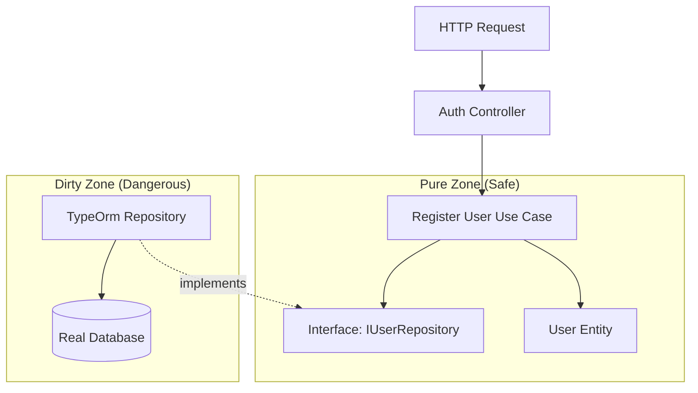

# Walkthrough: The "Register User" Flow

We will trace the journey of a request to **Register a new User**.

**The Feature**: A user sends `POST /auth/register` with `{ email, password }`. We need to create a user and save it.

---

## 1. The Entry Point: Presentation Layer
**File**: `src/presentation/controllers/auth.controller.ts`

This is where the HTTP request hits. Notice it has **no business logic**.

```typescript
@Post('register')
async register(@Body() body: RegisterUserDto) {
  // 1. Convert HTTP Body -> Command (Plain Object)
  const command = new RegisterUserCommand(body.email, body.password);
  
  // 2. Delegate to the Use Case
  // "this.registerUserUseCase" is injected!
  const result = await this.registerUserUseCase.execute(command);
  
  // 3. Return HTTP Response
  return result; 
}
```
> **Key Concept**: The Controller is just a "Adapter" that speaks HTTP. It translates `req.body` into something the application understands.

---

## 2. The Business Logic: Application Layer
**File**: `src/application/use-cases/register-user.use-case.ts`

This is the **heart** of the system. It orchestrates the flow.

```typescript
export class RegisterUserUseCase {
  constructor(
    // DEPENDENCY: We ask for an Interface, not a Database!
    private readonly userRepo: IUserRepository,
    private readonly passwordService: IPasswordService
  ) {}

  async execute(command: RegisterUserCommand): Promise<UserDto> {
    // 1. Check Rules (Business Logic)
    const existing = await this.userRepo.findByEmail(command.email);
    if (existing) throw new UserAlreadyExistsException();

    // 2. Create the Domain Entity (Pure Logic)
    const passwordHash = await this.passwordService.hash(command.password);
    const user = User.create(command.email, passwordHash); // Factory Method

    // 3. Save using the Interface
    await this.userRepo.save(user);

    // 4. Return DTO (Data Transfer Object)
    return UserMapper.toDto(user);
  }
}
```
> **Key Concept**: This file is "Certified Pure". It imports `IUserRepository`, which is just a TypeScript `interface`. It has **zero dependencies** on MongoDB, TypeORM, or SQL.

---

## 3. The Contract: Domain Layer
**File**: `src/domain/ports/i-user.repository.ts`

This defines the rules regarding data.

```typescript
export interface IUserRepository {
  save(user: User): Promise<void>;
  findByEmail(email: string): Promise<User | null>;
}
```

**File**: `src/domain/entities/user.entity.ts`

This defines **WHAT** a User is.

```typescript
export class User {
  // Pure Typescript class. 
  // Contains logic like user.validatePassword(), user.changeName()
  // NO database annotations (@Entity, @Column) here!
}
```

---

## 4. The Implementation: Infrastructure Layer (The "Dirty" Part)
**File**: `src/infrastructure/adapters/persistence/typeorm/repositories/typeorm-user.repository.ts` (Hypothetical path based on structure)

This is where the Interface gets converted to Reality.

```typescript
import { IUserRepository } from '../../domain/ports/i-user.repository';

// "implements IUserRepository" is the contract we signed!
export class TypeOrmUserRepository implements IUserRepository {
  constructor(private ormRepo: Repository<UserEntity>) {}

  async save(user: User): Promise<void> {
    // 1. Map Domain User -> DB Row (TypeORM Entity)
    const dbEntity = UserMapper.toPersistence(user);
    
    // 2. Actually save to Database
    await this.ormRepo.save(dbEntity);
  }
}
```

---

## Summary Diagram



**Why is this better?**
Look at the `Pure Zone`. The **Use Case** and **User Entity** point to *nothing* outside themselves. The flow of control goes *down* to the database, but the **Dependency points IN** (The DB implements the Interface).
