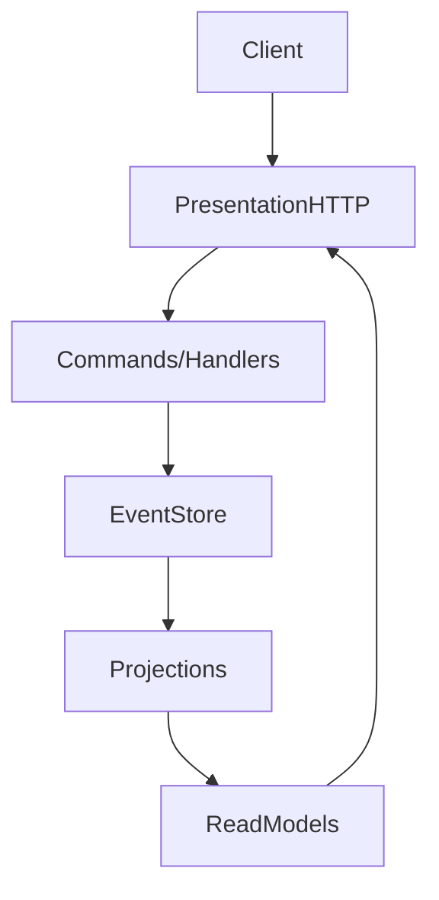

Boundaries and Data Flow
========================

Context
* Event-sourcing reference service with modules built around events and projections.

Data Flow (high level)

Boundaries
* Presentation: controllers accept commands/queries via DTOs.
* Application: command handlers emit events; queries read projections.
* Domain: aggregates and value objects shape events and invariants.
* Event Store: persists events and snapshots.
* Projections: build read models for queries.

Extension Points
* Add new command/handler under `modules/<feature>/application/commands`.
* Add new event types under `events`.
* Add projections under `projections` to serve new read models.

