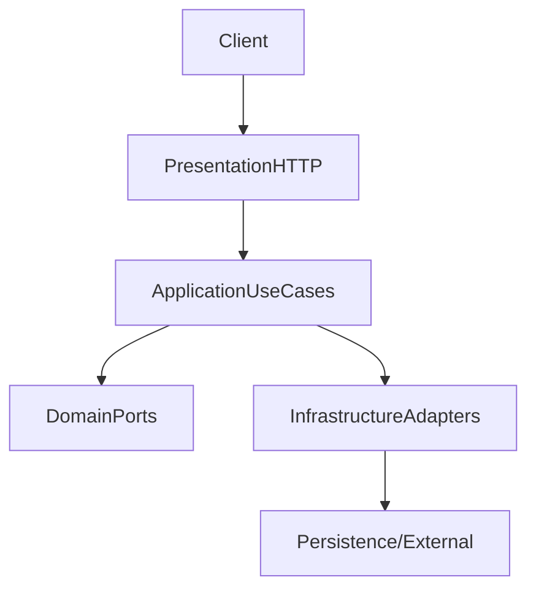

Boundaries and Data Flow
========================

Context
* Single service with hexagonal layering; adapters provide persistence, auth, external integrations.

Data Flow (high level)

Boundaries
* Presentation: controllers map DTOs to use cases.
* Application: orchestrates use cases; depends on domain ports.
* Domain: defines entities, value objects, ports.
* Infrastructure: implements ports (repositories, auth strategies, external services).

Extension Points
* Add a port in `domain/ports`, implement in `infrastructure`, wire in application module.
* Add routes/controllers in `presentation/http` to expose new use cases.

