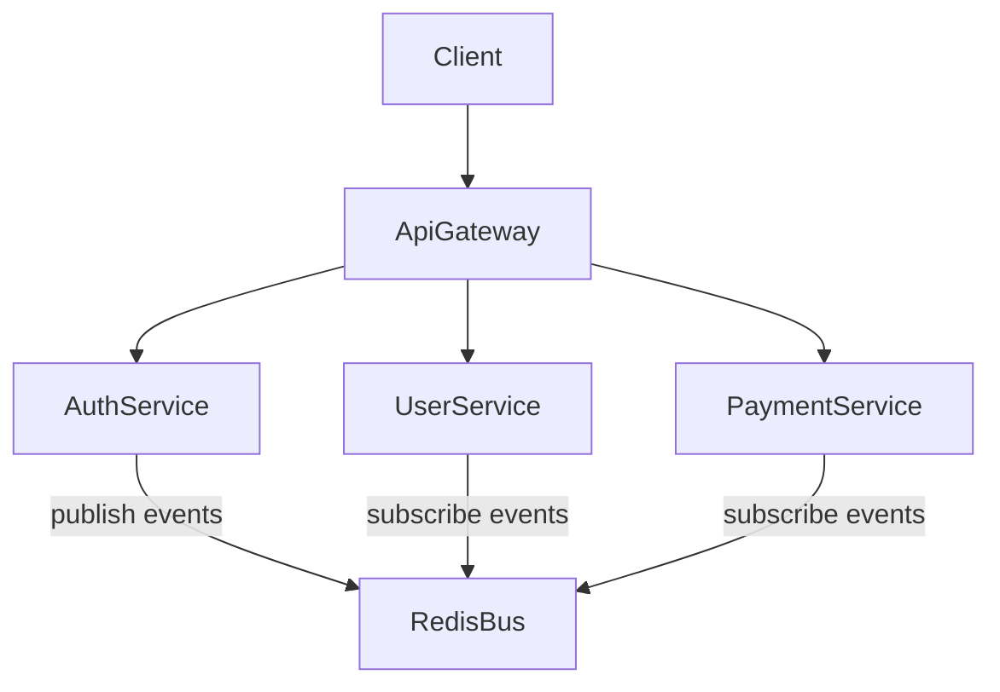

Boundaries and Data Flow
========================

Context
* Bounded contexts: api-gateway, auth-service, user-service, payment-service
* Integration style: REST plus Redis pub/sub examples

Data Flow (high level)

Boundaries
* Api Gateway: routing, auth delegation, aggregation
* Auth Service: identity, tokens, user registration events
* User Service: profile domain, consumes auth events
* Payment Service: payments domain, isolated persistence

Extension Points
* Add new service: define domain ports, implement adapters, expose controller, register module
* Replace broker: swap Redis adapter implementations behind existing ports
* Add new flow: publish domain events from application layer; subscribe via messaging adapter

